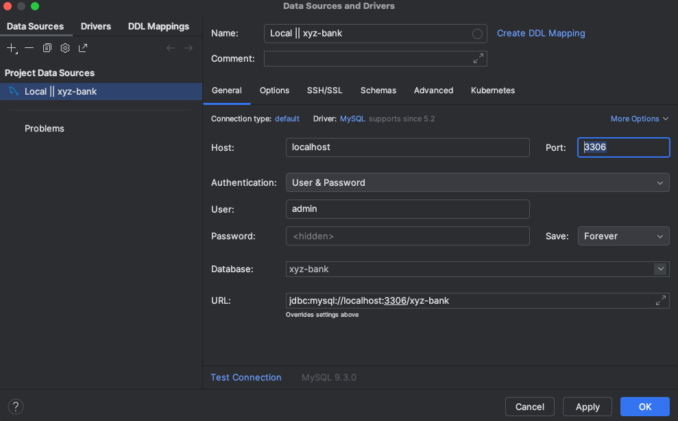
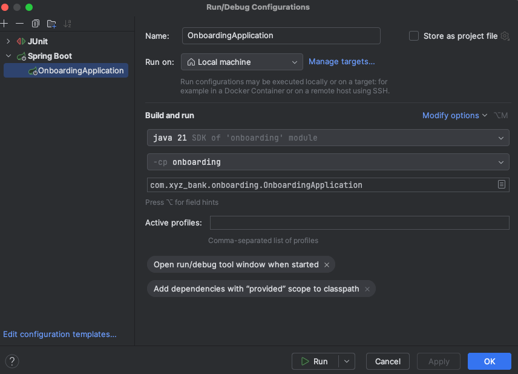

# XYZ-BANK

The XYZ Onboarding App is designed to simplify and streamline the process of becoming a new banking customer. With just a few quick steps, users can easily **create a new bank account**, **log in**, and **get a clear overview** of their account details

## Start docker container for database
Open  the terminal in the onboarding-ws package and execute the following command:
> docker compose up -d

The onboarding database should start, and you can access it by the following credentials
Username: admin
Password: admin

## Start Onboarding application
After making sure the project is build and doing a mvn clean install, you can start the application in your IDE. 
With the following run configuration.

## Using the application
When the application started you can use it via Swagger and Postman.
The swagger url is: http://localhost:8080/api/v1/swagger-ui/index.html
And over here is the [postman collection](https://.postman.co/workspace/My-Workspace~04eea9fa-6ebd-410c-8b46-957247a8f261/collection/33373164-afefcefa-110e-4005-b84a-4c32e45883de?action=share&creator=33373164)

## Creation process
In the project you also find a folder named 'documentation'. In here you find a file with the initial design to give 
myself some guidelines during the building process. Also I created a GitHub project to track the building process.
Here you can find the [XYZ-BANK project](https://github.com/users/MartijnvCitteren/projects/5)
